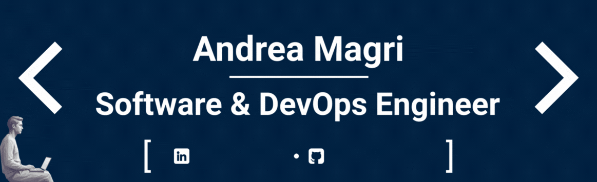

 

<!---->

<!---->

# 💫 About Me

- 💡 I'm a passionate **Researcher and Developer** specializing in cloud-native technologies. I design and build distributed, scalable, and resilient solutions, with a strong focus on optimizing dynamic workload distribution between Edge and Cloud environments.
- ⚡ Outside of coding and working, I love to **3D model, design, and produce prototypes with 3D printing**.
- 📫 How to reach me: **[GitHub](https://github.com/a-magri)**, **[LinkedIn](https://linkedin.com/in/a-magri)**

# 🌐 Socials
- 

- 

<!--### Technologies

 

 

 

-->

# 💻 Tech Stack

 

